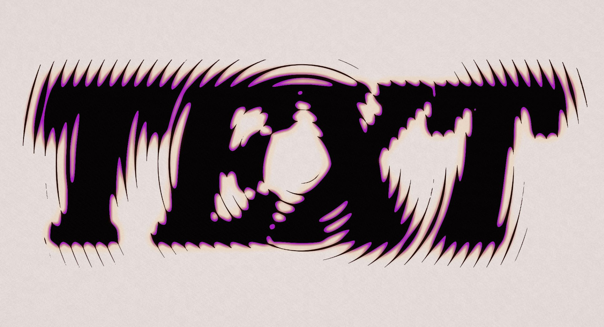

# VortexFX

An interactive typography and logo experiment built with React, Vite and WebGL.
Drag your artwork through a stationary circular field to create rippling edges,
fine warm filaments, subtle violet bloom and a grainy paper texture.



Inspired by *[Using Blender Like A Graphic Designer!](https://www.youtube.com/watch?v=72xChVM08jI)*.
This project recreates the visual technique in browser shaders. It is an
independent implementation, not an official adaptation. No tutorial footage,
screenshots, transcript or Blender project files are included.

## Run locally

Requires Node.js 22.12 or later.

```sh
npm ci
npm run dev
```

Open [localhost:3000](http://localhost:3000). Use `npm run dev` while experimenting
with fonts; the development server updates the font catalog when files change.
WebGL must be enabled in your browser. No local fonts are required to start.

## Create an effect

- Edit the text or import a transparent PNG or an SVG logo. Visible image content
  is converted to black while preserving transparency and antialiased edges.
  Opaque PNGs and empty images are rejected; background removal is not included.
- Drag the text or logo with your mouse or touch. Arrow keys also move it;
  hold Shift for larger steps. The circular field stays fixed.
- Effect force ranges from 0 to 100. Values 0–4 show the sharp black silhouette;
  blur and glow begin at 5. The default, 70, preserves the reference appearance.
- Adjust distortion, wave spacing and bloom independently. Thin filaments receive
  less bloom and a warmer dark tint; glow stays outside the black artwork.
- Enable animation and adjust wave speed: 0 freezes the phase, 50 is the default
  speed, and 100 speeds it up. Reset restores the default settings and position.
- Export the artwork as a PNG or enter fullscreen for an uncluttered preview.

Images are processed locally in the browser. Large imports are rasterized to a
maximum of 4096 pixels on their longest side.

## Fonts

The original artwork and the preview above use **Cambria Bold Italic**. Cambria
is not included in this repository; use your own appropriately licensed copy.
The preview is a rendered image, not an embedded font file.

**Charter**, particularly **original Bitstream Charter Bold Italic**, is a
recommended alternative for its expressive serif shapes. Check the license of
the specific distribution: the original
[Bitstream Charter license](https://spdx.org/licenses/Bitstream-Charter.html)
permits redistribution with its required notices, but other Charter editions
may have different terms.

**Inter** is the built-in fallback for both the artwork and interface. It is
provided locally by `@fontsource-variable/inter`, under the SIL Open Font License
1.1, without a third-party font CDN. It is always available in the selector.

```text
public/fonts/
  your-artwork-font.ttf
  ui/
    your-interface-Regular.woff2
```

Place artwork fonts in `public/fonts/` and interface fonts in `public/fonts/ui/`.
TTF, OTF, WOFF and WOFF2 files are discovered recursively. The dropdown includes
every discovered font, including those in `ui/`. For the interface, a filename
containing `Regular` is preferred; otherwise the first UI font is used. With no
UI fonts, the interface uses Inter. The first discovered artwork font is
selected automatically, in sorted path order; if only UI fonts exist, the first
of those is selected. No particular local font family or filename is required.
If a selected local font cannot load, the artwork falls back to Inter.

All local font files are excluded from Git, including files elsewhere in the
project. Only add fonts whose licenses permit your intended web use. **Vite still
serves local fonts and copies `public/` into builds**: review those files before
sharing a server or deploying. The build captures the font catalog at build time.

## How it works

Canvas 2D creates the source silhouette and two blurred masks. A WebGL shader
compares those masks against concentric waves with soft noise, then adds an
exterior glow, warm fine lines and film grain. Moving the artwork changes its
sampling coordinates while the field remains stationary. The mask blur sizes
are calibrated approximations of the Blender setup, rather than pixel-identical
Blender node outputs.

## Project layout

| Path | Purpose |
| --- | --- |
| `src/App.jsx` | React controls, source selection and interaction state |
| `src/renderer.js` | Canvas masks, WebGL shaders, dragging and PNG export |
| `src/import-image.js` | Image validation and black silhouette conversion |
| `src/fonts.js` | Local font loading and bundled Inter fallback |
| `src/styles.css` | Responsive interface styles |
| `scripts/font-catalog.mjs` | Recursive font discovery and Vite integration |
| `public/fonts/` | Ignored, optional local fonts |
| `public/licenses/` | Distributed font and runtime license notices |
| `tests/` | Import and font catalog checks, plus a browser test page |

## Development checks

```sh
npm run check
npm test
npm run build
```

The build checks production compilation and writes bundled dependency license
notices to `dist/licenses/dependencies.md`. Continue running the app with
`npm run dev` for local development. Optional browser integration checks are
available at [tests/browser.html](http://localhost:3000/tests/browser.html).

To run the compiled site locally:

```sh
npm run build
npm run preview
```

Open [localhost:4173](http://localhost:4173). The default build uses relative
asset paths, so `dist/` can be served at the root or under a subdirectory.
Serve it over HTTP; opening `dist/index.html` directly with `file://` is not
supported by the browser's module loading rules. Font files are automatically
discovered from `public/fonts/` during the build, including `ui/`, and copied
into `dist/fonts/`. Rebuild after adding or removing a font; a static browser
cannot list arbitrary files added to a server folder after compilation.
With no local fonts, bundled Inter works for both the artwork and interface.
Continue using `npm run dev` for everyday development.

## GitHub Pages deployment

The custom workflow in `.github/workflows/pages.yml` runs on pushes to `main`
and can also be started manually. It installs locked dependencies with `npm ci`,
checks the source, runs tests, builds for `/vortexfx/`, and deploys only `dist/`
to GitHub Pages. The project MIT license and dependency notices are included.
Local font files are not in the checkout, so the public site uses bundled Inter.

In [repository Settings → Pages](https://github.com/LihnNH/vortexfx/settings/pages),
set **Build and deployment → Source** to **GitHub Actions**. No custom secret or
`gh-pages` branch is needed. If a run fails before Pages is enabled, enable it
and rerun the workflow from the
[Actions tab](https://github.com/LihnNH/vortexfx/actions/workflows/pages.yml).
For a manual deployment, choose **Run workflow** with branch **main**.

After a successful deployment, open
[VortexFX on GitHub Pages](https://lihnnh.github.io/vortexfx/).
Future pushes to `main` publish updates automatically. Local development still
uses `npm run dev` at `http://localhost:3000/`.

The build path assumes a repository site. For a custom domain, change the
workflow's `PAGES_BASE_PATH` to `/` and configure the domain in Pages settings.

## License and attribution

Original project code and the generated preview are licensed under the
[MIT License](LICENSE), copyright 2026 LihnNH. Dependencies and fonts retain their
own licenses; the project MIT license does not replace them. See
[Third-party notices](THIRD_PARTY_NOTICES.md) for the bundled licenses.

The tutorial is credited above as visual inspiration. Proprietary font binaries
and tutorial assets are not distributed with the repository. Font and image
files you add yourself remain subject to their respective licenses.
